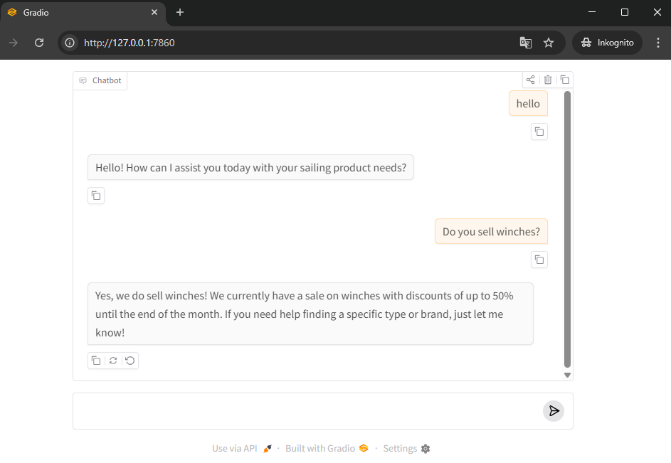

# Testing Chat Completions With Gradio, Without Building a Frontend

This project is a compact example of how to turn an OpenAI chat completion into something you can test like a real product conversation. Instead of wiring up a custom web app, the script hands the interface layer to Gradio and keeps the application logic focused on one thing: building the right message list for each model call.

The result is a lightweight chat sandbox that feels much closer to a finished assistant than a terminal loop. You get a browser-based UI, live streaming output, persistent conversation context across turns, and a clean place to experiment with prompt logic.



## Why This Script Is Useful

For early chatbot work, the biggest bottleneck is usually not the model call. It is the feedback loop.

If you test in a terminal, you can validate responses, but you do not get a realistic chat experience. If you build a frontend too early, you spend time on UI plumbing before you know whether the assistant behavior is any good. This script sits in the right middle ground.

With a few lines of code, it gives you:

- A browser chat interface powered by Gradio
- Streaming responses as tokens arrive
- Multi-turn conversation memory through chat history
- A place to inject system instructions and conditional prompt behavior

## The Core Idea

The entire app lives in [chat.py]. The `echo` function is the heart of the script. Every time the user submits a message in the Gradio chat UI, Gradio calls that function with two inputs:

- `message`: the latest user message
- `history`: the conversation so far

That means the model is not responding to a single prompt in isolation. It is responding to a reconstructed conversation.

## The Gradio Interface Is Doing Real Work

The line below is deceptively simple:

```python
gr.ChatInterface(fn=echo).launch()
```

That one call gives you a polished testing surface:

- A chat-style message layout in the browser
- Input handling for each new user turn
- Automatic passing of prior conversation history into your function
- Support for generator-based streaming so the reply appears progressively

This matters because it changes testing from “run a prompt” to “interact with a conversation.”

When you are evaluating a chat assistant, that distinction is important. A chat model often looks fine on a single turn and falls apart once context begins to accumulate. Gradio makes it easy to test those multi-turn conditions without adding a dedicated frontend stack.

## How Message Chaining Works

The most important line in the script is the one that builds the `messages` payload:

```python
messages = [{"role": "system", "content": system_message}] + history + [{"role": "user", "content": message}]
```

This is the conversation assembly step.

Before the model is called, the script creates a fresh list of messages for that specific turn:

1. It starts with the `system` message.
2. It appends the prior `history` provided by Gradio.
3. It adds the latest user message at the end.

That sequence is what preserves context.

The model does not remember earlier turns on its own between requests. Each API call is stateless. If you want the assistant to behave as if it remembers the conversation, you must send the previous turns back to the model every time. This script does exactly that.

In other words, the history is not magical memory inside the model. It is explicit replay.

## Why The Order Matters

The order of messages defines how the model interprets the conversation.

- The `system` message establishes the assistant's role and behavioral frame.
- The historical turns provide continuity.
- The latest user message tells the model what to answer now.

If you changed that order, the model would receive a different conversational structure. The current arrangement is the standard and correct pattern for multi-turn chat completion.

## Prompt Logic Can React To The User Input

This script also shows a small but useful prompt-engineering pattern. The base system instruction says the assistant is for a store selling high-performance sailing products. Then it conditionally expands that instruction:

```python
if "winch" in message.lower():
	system_message += " The store is having a sale on winches, with discounts up to 50% until the end of the month."
```

That means the assistant can adapt its behavior based on the current turn before the API request is sent.

This is simple, but it demonstrates a practical architecture:

- Keep a stable assistant identity in the system prompt
- Inject temporary business rules when certain topics appear
- Let the conversation history carry context across turns

For prototypes, this is often enough to test domain-specific behavior quickly.

## Streaming Makes The Chat Feel Alive

The function does not return a complete string immediately. It yields partial output as it arrives from the OpenAI streaming response:

```python
response = ""
for chunk in stream:
	response += chunk.choices[0].delta.content or ""
	yield response
```

That is why the assistant response can appear progressively in the Gradio UI instead of waiting for the full answer to finish first.

This improves testing in two ways:

- It feels closer to a production chat experience
- It makes it easier to notice latency and response shape while the answer is forming

For conversational applications, streaming is not just cosmetic. It changes perceived responsiveness.

## End-To-End Flow

Here is the runtime flow of a single message:

1. The user types into the Gradio chat box.
2. Gradio calls `echo(message, history)`.
3. The script creates a system prompt.
4. The script optionally augments that prompt if the message mentions `winch`.
5. The script rebuilds the full message list from system prompt, prior history, and current user turn.
6. The script sends that list to the OpenAI chat completions API with streaming enabled.
7. Partial tokens are yielded back to Gradio.
8. Gradio updates the visible chat response in real time.

That is the entire chatbot loop.

## Why This Pattern Scales Well For Prototyping

Even though the script is small, the structure is sound.

You can extend it by:

- Swapping models
- Adding richer system instructions
- Injecting product, pricing, or policy context
- Logging prompts and responses
- Adding tools, retrieval, or guardrails later

The important part is that the conversation assembly pattern already matches how serious chat apps work. The UI is minimal, but the message mechanics are real.

## Running The Script

Install the required packages:

```bash
pip install gradio openai python-dotenv
```

Set your API key in an environment variable or `.env` file:

```env
OPENAI_API_KEY=your_key_here
```

Then run:

```bash
python chat.py
```

Gradio will launch a local browser interface where you can test the assistant interactively.

## Final Takeaway

The best part of this script is not that it calls a model. Any short example can do that.

The useful part is that it pairs chat completion with a clean UI and the correct conversation mechanics. Gradio gives you a fast, pleasant interface for testing. The `history` argument gives you the previous turns. The `messages` list rebuilds the entire context on every request. Together, those pieces create a proper multi-turn chat prototype with very little code.

If you want to test conversational behavior without getting distracted by frontend work, this is the right shape of script.
